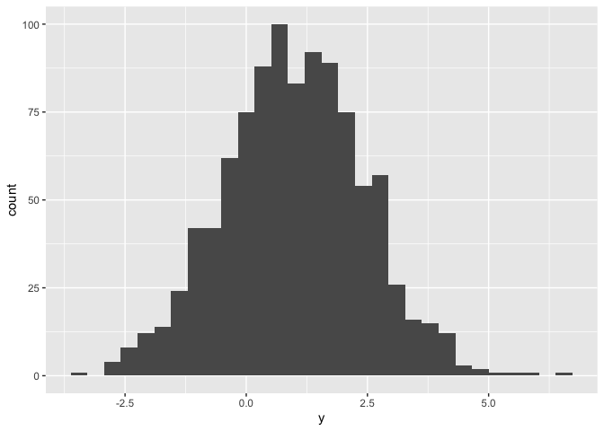

Basic Plots
================
2019-09-10

\#Github: 1. Create a GitHub repo on the Git website with an informative
name set to “Public”, initialize with a README, and create the repo

2.  Create a linked R Project using File &gt; New Project &gt; Version
    Control (Git) Provide the repository URL (copy from GitHub) Assign
    the Project a name (usually the same as the Github repo) Put the
    Project in a reasonable place on your computer

3.  Keep everything related to the analysis – data inputs, scripts,
    reports, output – in the same directory 4, Keep track of changes
    using version control (save, commit, push)

The purpose of this file is to present a couple of basic plots using
`ggplot`.

First we create a dataframe containing variables for our plots.

``` r
set.seed(1234)

plot_df = tibble(
  x = rnorm(1000, sd = .5),
  y = 1 + 2 * x + rnorm(1000)
)
```

First we show a histogram of the `x` variable.

``` r
ggplot(plot_df, aes(x = x)) + geom_histogram()
```

    ## `stat_bin()` using `bins = 30`. Pick better value with `binwidth`.

<!-- -->

Next we show a scatterplot of `y` vs `x`.

``` r
ggplot(plot_df, aes(x = x, y = y)) + geom_point()
```

<!-- -->

lastly, we show a histogram of the `y` variable.

``` r
ggplot(plot_df, aes(x = y)) + geom_histogram()
```

    ## `stat_bin()` using `bins = 30`. Pick better value with `binwidth`.

<!-- -->

# Section 1

\#\#Using code chunk:

take samples from a *normal distribution*:

``` r
samp = rnorm(100)
length(samp)
```

    ## [1] 100

# Section 2

## Using inline R code.

I can take the mean of the sample, too! The mean is 0.0558363.
